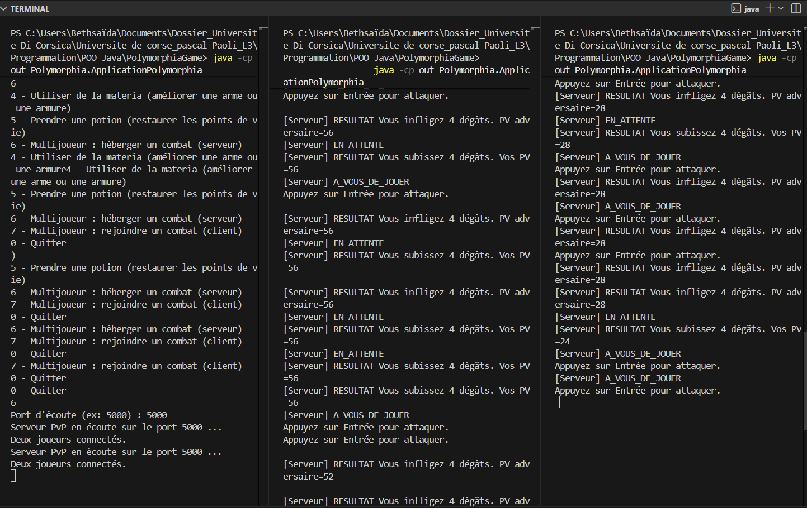

PolymorphiaGame – TP Java RPG Multijoueur

Projet réalisé dans le cadre du TP noté de Java – Licence Informatique L3.
Il s’agit d’un jeu RPG Heroic Fantasy en console, intégrant un mode solo (PvE)
et un mode multijoueur (PvP) en réseau client/serveur.

Auteurs

- Nouha El Abrouki, Bethsaida JEAN VALDEMAR
- (Binôme)

Présentation du jeu
Polymorphia est un monde fantastique peuplé de monstres.
Le joueur incarne Javalt de Riv, un chasseur de monstres qui explore ce monde,
combat des créatures, améliore ses compétences et son équipement, et peut
affronter un autre joueur en combat multijoueur.

Le jeu se joue entièrement dans la console.

Fonctionnalités

Mode solo (PvE)

- Déplacement dans le monde avec rencontres aléatoires
- Bestiaire de monstres (dragon, zombie, loup, gobelin)
- Combat au tour par tour
- Système de butin : intcoins, sorts, materia
- Marchand permettant d’acheter :
  - armes
  - armures / boucliers
  - potions
  - sorts
  - materia
- Gestion complète de l’inventaire
- Amélioration des statistiques via l’équipement et la materia

Mode multijoueur (PvP)

- Combat entre deux joueurs
- Architecture client / serveur
- Serveur accueillant deux connexions
- Attaques au tour par tour
- Calcul des dégâts basé sur les points d’attaque et de défense

Architecture du projet

Polymorphia
|
|-- combat : moteur de combat
|-- commerce : marchand et achats
|-- modele : joueur, monstre, inventaire, monde
|-- objet : armes, armures, potions, sorts, materia
|-- multijoueur : client et serveur PvP
|-- ApplicationPolymorphia.java (classe principale)

## 📐 Diagramme de classes UML

Le diagramme de classes ci-dessous représente l’architecture du projet Polymorphia.
Il met en évidence :

- l’héritage entre `Personnage`, `Joueur` et `Monstre`
- la composition avec `Inventaire`
- les relations entre les objets du jeu (armes, armures, potions, sorts, materia)
- l’architecture multijoueur client / serveur

Exécution du projet

Prérequis

- Java 17 (ou Java 14 minimum)
- Eclipse IDE

Importer le projet

1. Cloner le dépôt GitHub
2. Ouvrir Eclipse
3. File > Import > Existing Projects into Workspace
4. Sélectionner le dossier du projet

Lancer le jeu

- Exécuter la classe ApplicationPolymorphia.java
- Le menu principal s’affiche dans la console

Lancer le mode multijoueur

Étape 1 : serveur

- Lancer le jeu
- Choisir l’option :
  6 - Multijoueur : héberger un combat (serveur)
- Entrer un port (ex : 5000)

Étape 2 : clients

- Lancer le jeu sur deux consoles différentes
- Choisir :
  7 - Multijoueur : rejoindre un combat (client)
- Adresse serveur : 127.0.0.1
- Port : 5000

Les joueurs s’affrontent ensuite au tour par tour.

## 📸 Capture d’écran – Mode multijoueur

Ci-dessous, une capture d’écran illustrant un combat multijoueur (PvP) en console.
On peut y voir le serveur et les deux clients connectés, avec des attaques effectuées
au tour par tour.

